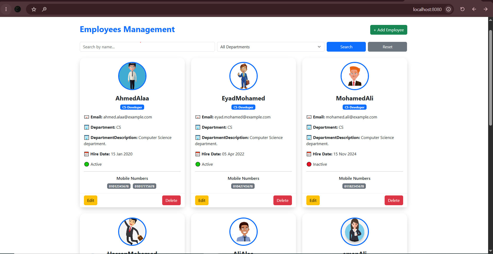
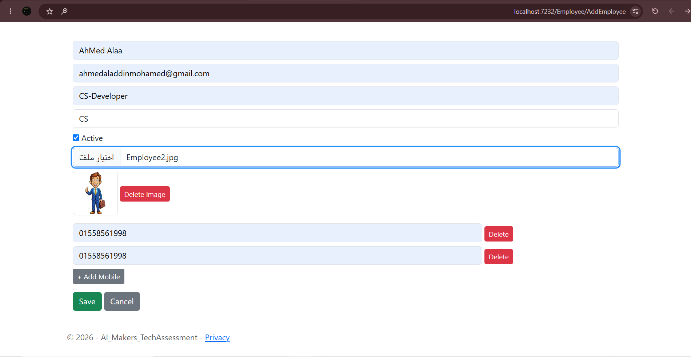
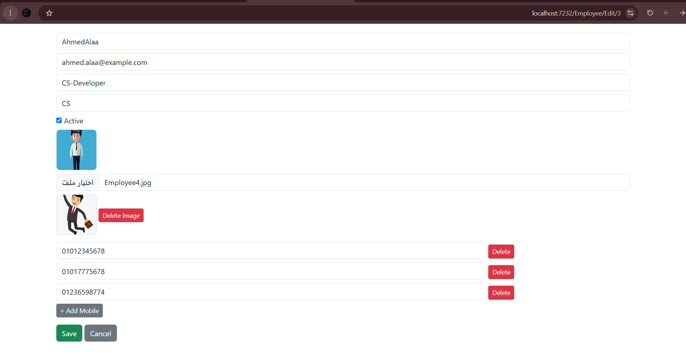
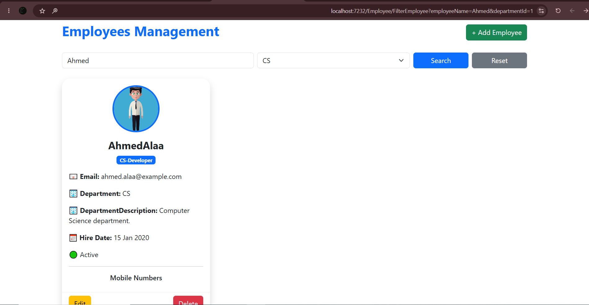

# Employee Management System

A professional Employee Management System built using ASP.NET Core MVC and SQL Server as part of the AI Makers .NET Developer Technical Assessment.

The project follows clean code principles and implements several software design patterns, including Repository Pattern, Unit of Work, and Service Layer. Additional enhancements such as AutoMapper, Docker support, automatic database migrations, database seeding, image upload, multiple phone numbers, and global exception handling have been included to improve maintainability, scalability, and user experience.

---

# Key Highlights

### Implemented Features

✅ Employee CRUD Operations

✅ Department Management

✅ Search Employees by Name and Department

✅ Employee Profile Image Upload

✅ Support for Multiple Phone Numbers per Employee

✅ Reset Search Filters

✅ Automatic Database Migration

✅ Database Seeding with Sample Data

✅ Friendly Error Handling

✅ Docker & Docker Compose Support

---

# Architecture & Design

The application was designed with maintainability and scalability in mind.

### Design Patterns Used

* Repository Pattern
* Generic Repository Pattern
* Unit of Work Pattern
* Service Layer Pattern
* Dependency Injection

### Code Organization

```text
Controllers
Data
HandleMiddleWares
Mapping
Migrations
Models
Repositories
Services
ViewModels
Views
```

This structure separates responsibilities between presentation, business logic, and data access layers, making the code easier to maintain, test, and extend.

---

# Technologies Used

### Backend

* ASP.NET Core MVC
* C#
* Entity Framework Core
* SQL Server

### Design & Mapping

* AutoMapper

### Infrastructure

* Docker
* Docker Compose

### Frontend

* HTML
* CSS
* JavaScript

---

# Business Features

## Employee Management

The system allows users to:

* Add employees
* Edit employee information
* Delete employees
* View employee details
* Browse employees through a centralized employee list

### Employee Information

Each employee includes:

* Full Name
* Email Address
* Multiple Phone Numbers
* Department
* Job Title
* Hire Date
* Active Status
* Profile Image

---

## Department Management

Departments are managed independently and linked to employees through a relational database structure.

---

## Search & Filtering

The application provides flexible filtering options:

* Search by Employee Name
* Search by Department
* Combined Search
* Reset Filters functionality

---

# Data Access Layer

The project uses:

### Generic Repository

Provides reusable CRUD operations for entities.

### Unit of Work

Ensures all repository operations are coordinated through a single transaction boundary.

### Services Layer

Business logic is isolated from controllers, resulting in cleaner and more maintainable code.

---

# Object Mapping

AutoMapper is used to map:

* Entities
* ViewModels

This keeps controllers and services clean and reduces repetitive mapping code.

---

# Error Handling

A custom global exception handling middleware was implemented.

### Benefits

* Handles unexpected exceptions centrally
* Prevents application crashes
* Displays user-friendly error messages
* Improves overall user experience
* Keeps technical exception details hidden from end users

---

# Database

SQL Server is used as the primary database.

### Main Tables

* Employees
* Departments
* EmployeePhoneNumbers

### Automatic Setup

The application automatically:

* Applies pending migrations on startup
* Creates the database if it does not exist
* Seeds sample data automatically

No manual database setup is required.

---

# Sample Data

The application ships with pre-seeded data to allow immediate testing after startup.

This includes:

* Multiple Departments
* Sample Employees
* Sample Phone Numbers

---

# Running the Application

## Option 1: Docker (Recommended)

Make sure Docker Desktop is running.

Run:

```bash
docker compose up --build
```

This command will:

* Build the application image
* Start SQL Server container
* Start the application container
* Configure the environment automatically

---

## Option 2: Visual Studio

1. Clone the repository

```bash
git clone <repository-url>
```

2. Open the solution

3. Run the project

The application will automatically:

* Apply migrations
* Create the database
* Seed sample data

No additional setup is required.

---

# Why These Decisions?

The project was implemented using Repository, Unit of Work, and Service Layer patterns to:

* Improve maintainability
* Reduce code duplication
* Separate concerns
* Simplify future enhancements
* Follow common enterprise development practices

Additional features such as Docker support, automatic migrations, database seeding, image upload, and global exception handling were added to provide a more complete and production-oriented solution.

---

# Screenshots

## Employee List



## Create Employee




## Edit Employee



## Search & Filtering



---

# Author

Ahmed Aladdin Mohamed Kamal

Developed for the AI Makers .NET Developer Technical Assessment.
